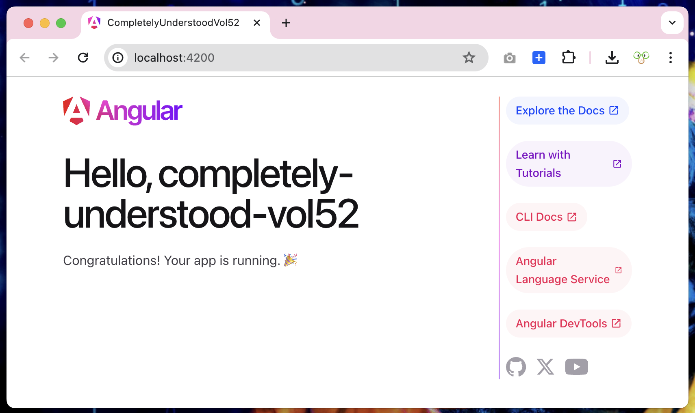
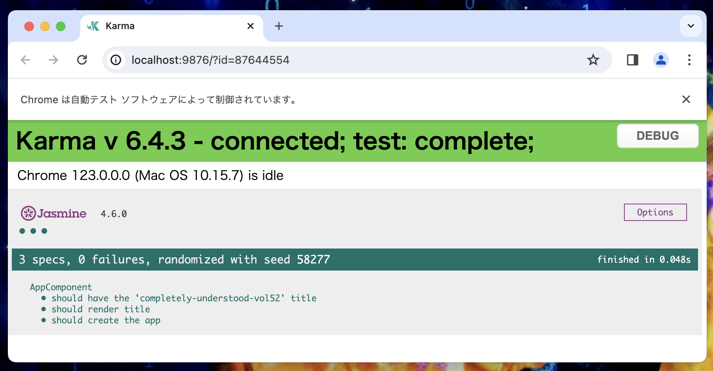
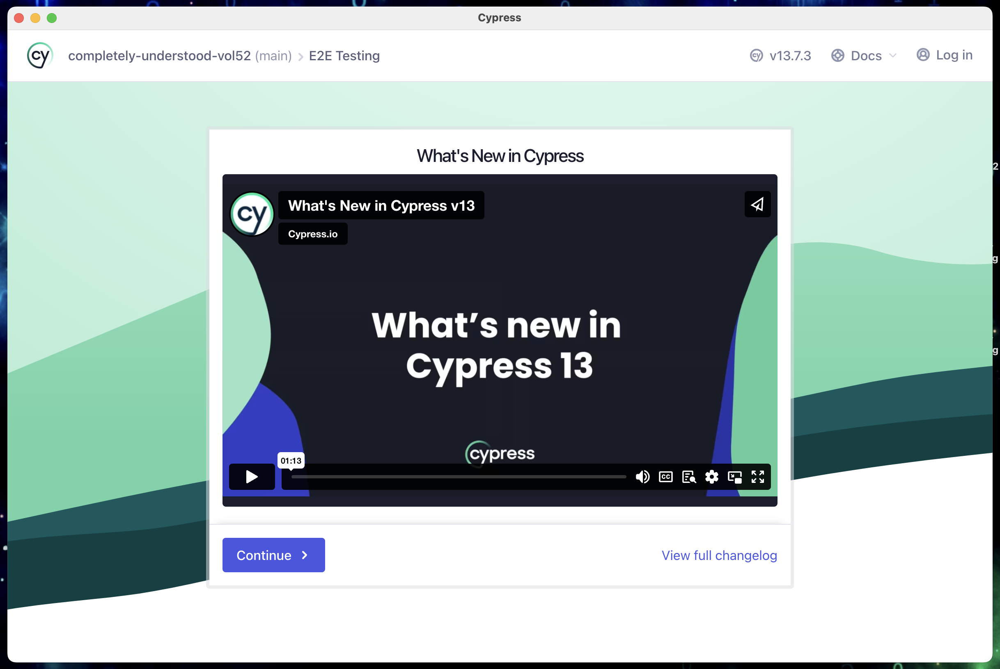

## Overview / 概要

- this repository is hands on & sample for Engineers' “Completely Understood” Talk #52
- この[リポジトリ](https://github.com/gurezo/completely-understood-vol52)は、エンジニア達の「完全に理解した」Talk #52 のハンズオン＆サンプルです。

### Things necessary / 必要なもの

- （ノート）パソコン
  - OS： Windows, macOS, Linux
- フロントエンド開発に必要な環境
  - node v18.x 以上推奨
  - npm v10.x 以上推奨

### サンプル用ディレクトリ作成

- 下記コマンドを実行します。

```sh
# work 配下にディレクトリ作成を想定しています
$ cd work

# completely-understood-vol52 というディレクトリを作成します
$ mkdir completely-understood-vol52

# completely-understood-vol52 に移動します
$ cd completely-understood-vol52
```

### Angular CLI のローカルインストール

- 下記コマンドを実行します。

```sh
# completely-understood-vol52 直下のディレクトリで、実行する想定です。
# --no-save オプションを付けることでこのディレクトリ配下にローカルインストールされます。
$　npm i @angular/cli@v17.x --no-save

added 4 packages, changed 16 packages, and audited 237 packages in 9s

44 packages are looking for funding
  run `npm fund` for details

found 0 vulnerabilities
$ completely-understood-vol52
```

### Angular プロジェクトの作成

- 下記コマンドを実行します。

```sh
# completely-understood-vol52 直下のディレクトリで、実行する想定です。
# --directory オプションを付けることでこのディレクトリ配下にプロジェクトを作成します。
$　npx ng new completely-understood-vol52 --directory=./

# スタイルファイルをどの形式か選択できます。（今回は、CSS を選択しました。
? Which stylesheet format would you like to use? (Use arrow keys)
❯ CSS             [ https://developer.mozilla.org/docs/Web/CSS                     ]
  Sass (SCSS)     [ https://sass-lang.com/documentation/syntax#scss                ]
  Sass (Indented) [ https://sass-lang.com/documentation/syntax#the-indented-syntax ]
  Less            [ http://lesscss.org                                             ]

? Do you want to enable Server-Side Rendering (SSR) and Static Site Generation (SSG/Prerendering)? No
CREATE README.md (1079 bytes)
CREATE .editorconfig (274 bytes)
CREATE .gitignore (548 bytes)
CREATE angular.json (2697 bytes)
CREATE package.json (1058 bytes)
CREATE tsconfig.json (857 bytes)
CREATE .vscode/extensions.json (130 bytes)
CREATE .vscode/launch.json (470 bytes)
CREATE .vscode/tasks.json (938 bytes)
CREATE src/app/app.component.css (0 bytes)
CREATE src/app/app.component.html (19903 bytes)
CREATE src/app/app.component.spec.ts (979 bytes)
CREATE src/app/app.component.ts (323 bytes)
CREATE src/main.ts (250 bytes)
CREATE src/app/app.config.ts (227 bytes)
CREATE src/app/app.routes.ts (77 bytes)
CREATE tsconfig.app.json (263 bytes)
CREATE tsconfig.spec.json (273 bytes)
CREATE src/favicon.ico (15086 bytes)
CREATE src/index.html (311 bytes)
CREATE src/styles.css (80 bytes)
CREATE src/assets/.gitkeep (0 bytes)
⠏ Installing packages (npm)...

$ completely-understood-vol52
```

### Angular プロジェクトの構造

- プロジェクト作成に成功すると下記ディレクトリ構造になります。

```sh
completely-understood-vol52 # angular プロジェクトルートディレクトリ
├── README.md
├── angular.json # angular プロジェクト情報
├── package-lock.json
├── package.json
├── src
│   ├── app
│   │   ├── app.component.css # ブラウザ表示用スタイルファイル
│   │   ├── app.component.html # ブラウザ表示用ファイル
│   │   ├── app.component.spec.ts # ユニットテストファイル
│   │   ├── app.component.ts # 画面制御ファイル
│   │   ├── app.config.ts # Angular アプリケーション設定ファイル
│   │   └── app.routes.ts # Angular アプリケーション画面ナビゲーションファイル
│   ├── assets
│   ├── favicon.ico
│   ├── index.html
│   ├── main.ts
│   └── styles.css
├── tree.txt
├── tsconfig.app.json
├── tsconfig.json
└── tsconfig.spec.json
```

### Angular プロジェクトのローカル起動

- 下記コマンドを実行します。

```sh
# completely-understood-vol52 直下のディレクトリで、実行する想定です。
# --open オプションを付けることで、デフォルトブラウザでローカル起動します。
$ npx ng serve --open
Initial chunk files | Names         |  Raw size
polyfills.js        | polyfills     |  83.60 kB |
main.js             | main          |  21.94 kB |
styles.css          | styles        |  95 bytes |

                    | Initial total | 105.63 kB

Application bundle generation complete. [0.760 seconds]

Watch mode enabled. Watching for file changes...
  $ Local:   http://localhost:4200/
  $ press h + enter to show help


# ctrl+c で、終了します。
$
```



### Angular プロジェクトのユニットテスト実行

- 下記コマンドを実行します。
- テストは、[Karma](https://karma-runner.github.io/latest/index.html) と [Jasmine](https://jasmine.github.io/) を使います。
- ※デフォルトテストツール

```sh
# completely-understood-vol52 直下のディレクトリで、実行する想定です。
$ npx ng test
✔ Browser application bundle generation complete.
14 04 2024 17:49:27.053:WARN [karma]: No captured browser, open http://localhost:9876/
14 04 2024 17:49:27.059:INFO [karma-server]: Karma v6.4.3 server started at http://localhost:9876/
14 04 2024 17:49:27.060:INFO [launcher]: Launching browsers Chrome with concurrency unlimited
14 04 2024 17:49:27.064:INFO [launcher]: Starting browser Chrome
14 04 2024 17:49:28.221:INFO [Chrome 123.0.0.0 (Mac OS 10.15.7)]: Connected on socket xmKi2hSp8e7YZeOqAAAB with id 87644554
Chrome 123.0.0.0 (Mac OS 10.15.7): Executed 3 of 3 SUCCESS (0.047 secs / 0.044 secs)
TOTAL: 3 SUCCESS

# ctrl+c で、終了します。
$
```



### Angular プロジェクトの E2E テスト実行

- 下記コマンドを実行すると下記メッセージが聞かれます。

#### Google のプライバシーポリシー の確認

```sh
# completely-understood-vol52 直下のディレクトリで、実行する想定です。
$ npx ng e2e

# ? このプロジェクトに関する仮名の使用状況データを Angular チームと共有しますか?
# Google のプライバシー ポリシー (https://policies.google.com/privacy) に基づいて Google に問い合わせます。 多くのための
# この設定の詳細と変更方法については、https://angular.io/analytics を参照してください。 (y/N)

? Would you like to share pseudonymous usage data about this project with the Angular Team
at Google under Google's Privacy Policy at https://policies.google.com/privacy. For more
details and how to change this setting, see https://angular.io/analytics. No

# No を選択
```

#### E2E テストツールの選択

```sh
# 続き
Global setting: enabled
Local setting: disabled
Effective status: disabled
Cannot find "e2e" target for the specified project.
You can add a package that implements these capabilities.

# E2E テストツールをどれを選択するか？
# Cypress を選択します。
# デフォルトの E2E テストツール Protoractor は、deprecated（非推奨）の為
For example:
  Cypress: ng add @cypress/schematic
  Nightwatch: ng add @nightwatch/schematics
  WebdriverIO: ng add @wdio/schematics
  Puppeteer: ng add @puppeteer/ng-schematics
```

#### E2E テストの変換（Cypress）

```sh
# E2E テストツールをCypress 変換するか聞かれます

Would you like to add a package with "e2e" capabilities now? Cypress
ℹ Using package manager: npm
✔ Found compatible package version: @cypress/schematic@2.5.1.
✔ Package information loaded.

The package @cypress/schematic@2.5.1 will be installed and executed.
# Yes を選択します。
Would you like to proceed? Yes


? Would you like the default `ng e2e` command to use Cypress? [ Protractor to Cypress Migration Guide:
https://on.cypress.io/protractor-to-cypress?cli=true ] Yes
? Would you like to add Cypress component testing?  This will add all files needed for Cypress component
testing. Yes
CREATE cypress.config.ts (264 bytes)
CREATE cypress/tsconfig.json (139 bytes)
CREATE cypress/e2e/spec.cy.ts (143 bytes)
CREATE cypress/fixtures/example.json (85 bytes)
CREATE cypress/support/commands.ts (1377 bytes)
CREATE cypress/support/e2e.ts (649 bytes)
CREATE cypress/support/component-index.html (290 bytes)
CREATE cypress/support/component.ts (1123 bytes)
UPDATE package.json (1210 bytes)
UPDATE angular.json (4211 bytes)
✔ Packages installed successfully.
$
```

#### E2E テストの実行（Cypress の E2E コード）

```sh
# completely-understood-vol52 直下のディレクトリで、実行する想定です。
# Cypress のE2E コードで、実行されます。
$ npx ng e2e
Passing watch mode to DevServer - watch mode is true
Initial chunk files | Names         |  Raw size
polyfills.js        | polyfills     |  83.60 kB |
main.js             | main          |  21.94 kB |
styles.css          | styles        |  95 bytes |

                    | Initial total | 105.63 kB

Application bundle generation complete. [1.038 seconds]

Watch mode enabled. Watching for file changes...
  $ Local:   http://localhost:4200/
  $ press h + enter to show help

DevTools listening on ws://127.0.0.1:50358/devtools/browser/15192f20-eaf4-4499-818a-62362f5ea7ed
GraphQL server is running at http://localhost:50359/__launchpad/graphql
Missing baseUrl in compilerOptions. tsconfig-paths will be skipped
2024-04-14 18:02:15.299 Cypress[70068:29569977] WARNING: Secure coding is not enabled for restorable state! Enable secure coding by implementing NSApplicationDelegate.applicationSupportsSecureRestorableState: and returning YES.

# ctrl+c で、終了します。
$
```


